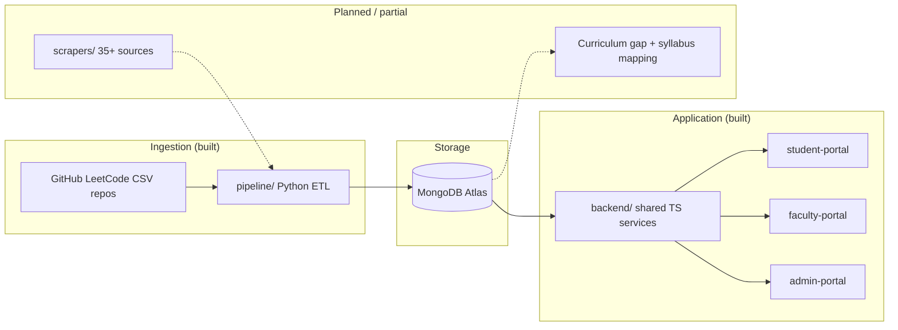

# NST Interview Prep Portal (PlacePrep)

A unified data-driven portal with two distinct use cases — helping NST students prepare for technical interviews at specific companies, and helping faculty align the B.Tech CS & AI curriculum with what industry actually tests and hires for.

> **Architecture, data state, known bugs, and local dev:** see [CONTEXT.MD](./CONTEXT.MD) — the single source of truth for how this repo actually works.

## Live Deployments

| Portal | URL |
|--------|-----|
| 🧑‍🎓 Student Portal | https://nst-prepportal-frontend.vercel.app/ |
| 👨‍🏫 Faculty Portal | https://nst-prepportal-frontend-khaki.vercel.app/ |
| 👨‍💼 Admin Portal | https://nst-prepportal-frontend-fs6o.vercel.app/ |

---

## Project Overview

Both use cases share MongoDB-backed company and question data. **Today:** ~678 companies and ~20,372 LeetCode-style questions ingested via the Python pipeline (GitHub CSV repos). The source list below is the **target** inventory — only one scraper/parser is built so far; see [CONTEXT.MD](./CONTEXT.MD).

### Use Case 1: Company-Specific Interview Prep Portal (Student-Facing)

An intelligent, structured guide that answers questions like:
- What topics does Google typically test in its SDE interviews?
- What is the typical interview format at a company like Amazon or Flipkart?
- What LeetCode-style problem categories appear most frequently at a given company?
- Are there common system design or behavioral questions for a particular role?

### Use Case 2: Curriculum Intelligence Dashboard (Faculty-Facing)

An internally-facing tool for faculty and academic planners that answers:
> *Are the skills we teach in our B.Tech CS & AI curriculum aligned with what companies actually test and hire for?*

Concretely, this means mapping structured interview data — topics, skills, problem types — against the existing course syllabus to produce a **gap analysis**: topics industry expects but aren't taught, and topics heavily covered that may have lower industry relevance.

---

## Data Sources (Target Inventory)

> **Currently ingested:** GitHub LeetCode company-wise CSV repos only (`pipeline/`). Everything below is aspirational — help us expand. See [scrapers/README.md](./scrapers/README.md) and [CONTEXT.MD](./CONTEXT.MD).

### DSA & Coding Problem Platforms

| Source | What It Contains |
|--------|-----------------|
| [GeeksForGeeks](https://www.geeksforgeeks.org) | Company-tagged DSA problems, interview experiences, topic-wise questions |
| [LeetCode Discuss](https://leetcode.com/discuss) | Company-tagged problems, community interview reports |
| [InterviewBit](https://www.interviewbit.com) | Topic and company-wise structured problem sets |
| [HackerRank](https://www.hackerrank.com) | Role-based coding challenges, company-sponsored contests |
| [HackerEarth](https://www.hackerearth.com) | Coding challenges, campus hiring contest archives |
| [CodeChef](https://www.codechef.com) | Competitive programming problems, company hiring contests |
| [Codeforces](https://codeforces.com) | Competitive programming problem archive |
| [AlgoExpert](https://www.algoexpert.io) | Curated interview problems with video explanations |
| [NeetCode](https://neetcode.io) | Curated LeetCode roadmap by topic and company |
| [Coding Ninjas](https://www.codingninjas.com) | Company-wise DSA problems, very popular in Indian colleges |
| [Educative.io](https://www.educative.io) | Grokking series — system design, coding patterns |

### Indian Placement & Job Portals

| Source | What It Contains |
|--------|-----------------|
| [AmbitionBox](https://www.ambitionbox.com) | Indian company-specific interview experiences and questions |
| [Naukri.com](https://www.naukri.com) | Job postings with skill tags relevant to Indian tech market |
| [PrepInsta](https://prepinsta.com) | Company-wise placement papers, aptitude & coding questions |
| [IndiaBix](https://www.indiabix.com) | Aptitude, verbal, technical MCQs — widely used for campus prep |
| [FacePrep](https://www.faceprep.in) | Company-specific placement prep, mock tests |
| [CareerRide](https://www.careerride.com) | Interview questions by company and technology |
| [Freshersworld](https://www.freshersworld.com) | Fresher job listings, off-campus drives, placement papers |
| [Workat.tech](https://workat.tech) | Indian startup interview experiences, DSA practice |
| [Instahyre](https://www.instahyre.com) | Indian tech hiring, skill-based job matching |

### Company Reviews & Interview Experiences

| Source | What It Contains |
|--------|-----------------|
| [Glassdoor](https://www.glassdoor.com) | Interview reviews, question logs by company and role, difficulty ratings |
| [Blind / TeamBlind](https://www.teamblind.com) | Anonymous tech worker posts — interview experiences, offers, comp data |
| [Levels.fyi](https://www.levels.fyi) | Compensation data + interview difficulty ratings by company and level |
| [Prepfully](https://prepfully.com) | Interview experiences and mock interview reviews |
| [CareerCup](https://www.careercup.com) | Interview questions shared by candidates, organized by company |

### Job Listings & Skills Intelligence

| Source | What It Contains |
|--------|-----------------|
| [LinkedIn Jobs](https://www.linkedin.com/jobs) | Job descriptions, required skills by company and role |
| [Indeed](https://www.indeed.com) | Job postings with skill requirements, salary estimates |
| [Wellfound (AngelList)](https://wellfound.com) | Startup job listings with explicit tech stack and skill requirements |
| [Cutshort](https://cutshort.io) | Indian tech hiring — skill-tagged job listings |

### Community & Discussion

| Source | What It Contains |
|--------|-----------------|
| [Reddit — r/cscareerquestions](https://www.reddit.com/r/cscareerquestions) | Anecdotal interview experiences, FAANG prep threads |
| [Reddit — r/india](https://www.reddit.com/r/india) | Indian company interview experiences, placement discussions |
| [Reddit — r/developersIndia](https://www.reddit.com/r/developersIndia) | Indian dev community — job prep, interview experiences |
| [Quora](https://www.quora.com) | Interview experience Q&As, company-specific threads |

### Curated Repositories & Open Content

| Source | What It Contains |
|--------|-----------------|
| [GitHub Repos](https://github.com) | Curated interview prep repos (e.g. awesome-interview-questions, system-design-primer) |
| [System Design Primer](https://github.com/donnemartin/system-design-primer) | Comprehensive system design interview resource |
| [Tech Interview Handbook](https://www.techinterviewhandbook.org) | Structured guide — algorithms, behavioral, offers |
| [NeetCode.io Roadmap](https://neetcode.io/roadmap) | Structured DSA roadmap with company frequency tags |

### Supplementary / Niche Sources

| Source | What It Contains |
|--------|-----------------|
| [GreatFrontEnd](https://www.greatfrontend.com) | Frontend-specific interview questions (HTML, CSS, JS, React) |
| [ByteByByte](https://www.byte-by-byte.com) | Algorithm interview breakdowns with solutions |
| [interviewing.io](https://interviewing.io) | Mock interview recordings and feedback (public blog posts) |
| Company Engineering Blogs | Tech blogs from Google, Meta, Uber, etc. — insight into problem-solving culture |

### Data Fields Captured

- Company name and role/level (e.g., SDE-1, SDE-2, Data Analyst)
- Interview round type (technical coding, system design, HR, managerial)
- Topic/skill area (e.g., Dynamic Programming, OS, DBMS, Machine Learning)
- Problem statement or question summary
- Source URL and date of collection
- Difficulty level (Easy / Medium / Hard, if available)
- Frequency/recurrence signal (how often a topic/question appears)

---

## Technical Pipeline



| Stage | Description | Status |
|-------|-------------|--------|
| GitHub CSV ingestion | Clone repos, parse company-wise LeetCode CSVs | ✅ Done |
| MongoDB ETL | Ingest → dedupe → transform → classify → promote | ✅ Done |
| Student / faculty / admin portals | Next.js apps + API routes → backend → MongoDB | ✅ Deployed |
| Additional scrapers (35+ sources) | `scrapers/` folder — not built yet | 🔲 Planned |
| Curriculum intelligence (Use Case 2) | Heuristic gap preview only; full syllabus mapping TBD | 🟡 Partial |

Full stack and data details: [CONTEXT.MD](./CONTEXT.MD). Pipeline run order: [pipeline/README.md](./pipeline/README.md).

---

## Repository Structure

```
PlacePrep/
├── backend/           # Shared TS service layer (Mongoose models, services — no HTTP server)
├── dashboard/         # student-portal, faculty-portal, admin-portal (Next.js + API routes)
├── pipeline/          # Working Python MongoDB ETL (GitHub LeetCode CSV repos)
├── scrapers/          # README only — planned scrapers, not built
├── schema/            # README only — planned PostgreSQL design, not used
├── data/              # README only — planned local data folders
├── docs/              # Documentation and analysis
└── CONTEXT.MD         # Source of truth for architecture & project state
```

---

## Getting Started

```bash
git clone https://github.com/edusatyaki/NST-Interview-Prep-Portal.git
cd NST-Interview-Prep-Portal
npm install
```

See [CONTEXT.MD](./CONTEXT.MD) for env vars, portal dev commands, and pipeline setup.

---

## Contributing a Data Source

We're actively looking for more high-quality sources. If you know a website, forum, dataset, or community that has interview questions, company hiring patterns, or skill requirements — **please add it**.

### How to contribute

1. Fork this repository
2. Add your source to the appropriate table in the [Data Sources](#data-sources) section above
3. Use this format:

```
| [Source Name](https://url.com) | One line describing what data it contains and why it's useful |
```

4. Open a Pull Request with the title: `Add data source: <Source Name>`

### What makes a good data source?
- Contains **company-specific** interview questions or experiences
- Has **topic or skill tags** (even informal ones)
- Is **publicly accessible** (no login wall, or login-only but widely accessible)
- Relevant to **Indian tech market** or **FAANG / top product companies**
- Not already listed above

> If you've personally used a resource to prep for interviews and found it useful — that's a great signal. Add it!

---

## License

This project is for educational and research purposes at NST. Data is sourced from publicly available platforms in compliance with their respective Terms of Service.
